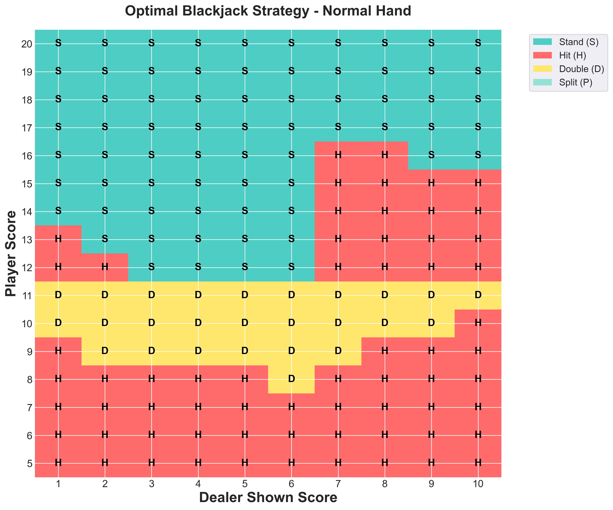

# Blackjack Simulator

A computational exercise implementing a recursive blackjack simulator in Go to explore all possible game states and determine optimal playing strategies through statistical analysis.

While blackjack is a solved game with well-documented optimal strategies, this project serves as a computational exercise in:

- Recursive algorithm implementation
- State space exploration
- Statistical data collection and analysis + visualisations
- Go programming language proficiency

The simulator provides empirical validation of theoretical blackjack strategies through comprehensive state space exploration and statistical analysis.

## Analysis and Findings

Number of hands simulated: 1,000,000,000 hand simulation.
All possible gamestates are explored for all hands (to cover every possible player option from this position).
This therefore will result in over ~9,000,000,000 hand outcomes being evaluated.

The analysis produces optimal strategy heatmaps for three types of hands:

1. **Hard Hands** (no ace)
2. **Soft Hands** (with ace)
3. **Pairs** (split available)

### Strategy Heatmaps

#### Hard Hand Strategy



#### Soft Hand Strategy (With Ace)

.png>)

#### Pair Strategy (Split Available)

.png>)

### Key Findings

Based on the simulation data:

#### Overall Statistics

- **Total game states analyzed**: 350
- **Most common optimal action**: Hit (32.9% of situations)
- **Average expected value**: +0.022 (slight player advantage with optimal play)
- **Best possible situation**: Splitting 2s against dealer's 6 (EV: +1.12)
- **Worst situation**: Hard 16 vs dealer 9 (EV: -0.71)

**Action distribution across all states:**

- Hit: 115 states (32.9%)
- Stand: 114 states (32.6%)
- Double: 62 states (17.7%)
- Split: 59 states (16.9%)

#### Strategy by Hand Type

**Hard Hands (Normal)**

- States analyzed: 160
- Average EV: -0.12 (player disadvantage)
- Strategy: Stand (43.1%), Hit (40.6%), Double (16.2%)
- Most challenging: Hard 12-16 vs dealer's high cards (7-10, Ace)

**Soft Hands (Has Ace)**

- States analyzed: 90
- Average EV: +0.14 (player advantage)
- Strategy: Hit (35.6%), Stand (34.4%), Double (30.0%)
- Key advantage: Flexibility of the ace allows aggressive doubling vs weak dealer cards

**Pairs (Split Available)**

- States analyzed: 100
- Average EV: +0.15 (best overall category)
- Strategy: Split (59.0%), Hit (18.0%), Stand (14.0%), Double (9.0%)
- Always split: Aces and 8s
- Never split: 10s and 5s
- Best opportunities: Low pairs vs dealer's weak cards

#### Dealer Impact

Dealer's shown card significantly affects player advantage:

**Average EV by dealer shown score (worst to best for player):**

- Dealer shows 10: -0.34
- Dealer shows 9: -0.20
- Dealer shows Ace: -0.20
- Dealer shows 8: -0.06
- Dealer shows 2: +0.05
- Dealer shows 7: +0.08
- Dealer shows 3: +0.10
- Dealer shows 4: +0.19
- Dealer shows 5: +0.28
- **Best for player**: Dealer shows 6: +0.33

**Strategic implications:**

- **Weak dealer cards** (4-6): Player should be more aggressive with doubles and splits
- **Strong dealer cards** (9, 10, Ace): Conservative play with focus on not busting

### Performance Insights

The recursive simulation explores all possible game paths to determine mathematically optimal strategies. The results align closely with traditional basic strategy charts, validating the simulation's accuracy while providing precise expected value calculations for each decision point.

## Project Structure

```
blackjack/
├── main.go              # Entry point with CLI and simulation modes
├── go.mod              # Go module configuration
├── game/               # Core game logic
│   ├── game.go         # GameState and mechanics
│   └── cards.go        # Card and Deck structures
├── sim/                # Simulation engine
│   ├── sim.go          # Recursive exploration logic
│   └── data.go         # Data collection and persistence
├── analysis/           # Python analysis tools
│   ├── blackjack_analysis.ipynb  # Jupyter notebook
│   ├── requirements.txt          # Python dependencies
└── bj_sim_data.json    # Simulation results
```

## Technical Implementation

### Core Features

- **Recursive State Exploration**: Explores all possible game outcomes from each decision point
- **Deep Copy System**: Ensures independent simulation branches
- **Bitfield Move System**: Efficient legal move representation
- **Multi-Hand Support**: Handles complex splitting scenarios
- **Statistical Data Collection**: Records expected values and trial counts

### Game Mechanics

- Standard casino rules (dealer hits on 16, stands on 17)
- Actions: Hit, Stand, Double Down, Split
- Proper ace handling (soft/hard conversion)
- Bet value tracking for expected value calculation
- BlackJack (score = 21) does NOT pay 3:2

### Data Structure

Simulation results are stored hierarchically:

```
[Dealer Score][Player Score][Hand Category][Action] → {Expected Value, Trials}
```

- **Dealer Score**: 1-10 (1=Ace, 10=10/Face)
- **Player Score**: 2-20
- **Hand Category**: 0=Hard, 1=Soft, 2=Pair
- **Action**: 0=Hit, 1=Stand, 2=Double, 3=Split

## Dependencies

- **Go 1.x+**: Core simulator (no external dependencies)
- **Python 3.7+**: Analysis tools
  - jupyter
  - pandas
  - matplotlib
  - seaborn
  - numpy
